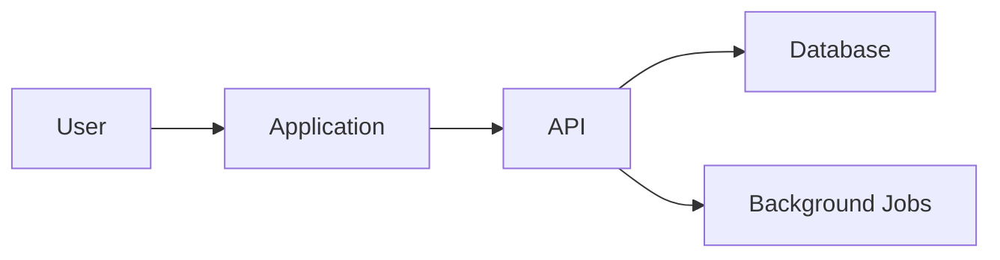

# Architecture RFC

- Title:
- Owner:
- Date:
- Status: Draft / Accepted / Superseded

## Context

What product requirement, scale target, or risk drives this design?

## Goals

- 

## Non-goals

- 

## Proposed Architecture

## Interfaces

| Boundary | Contract | Failure Mode | Test |
| --- | --- | --- | --- |
|  |  |  |  |

## Quality Attributes

| Attribute | Target | Measurement |
| --- | --- | --- |
| Latency |  |  |
| Availability |  |  |
| Security |  |  |
| Maintainability |  |  |

## Trade-offs

| Option | Pros | Cons | Decision |
| --- | --- | --- | --- |
|  |  |  |  |

## Rollout Plan

- Migration:
- Feature flag:
- Observability:
- Rollback:
